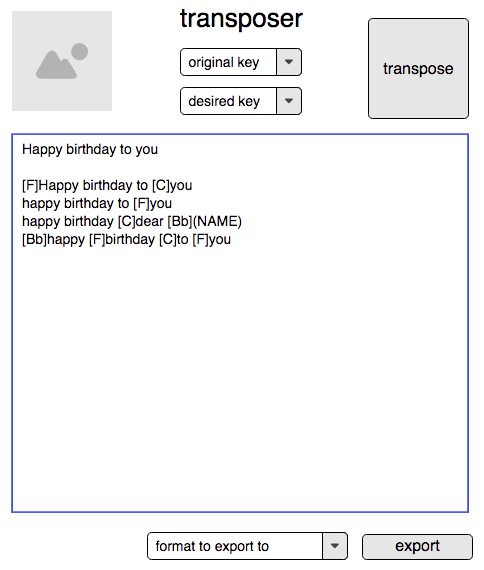

# Introduction

-   Make a web application

-   Use TDD approach

-   Base it off of the beginnings of tutorials from Dan B.

-   Use the following technology stack from Dan's tutorial work

    -   Express - node.js framework

    -   Jasmine - testing framework

    -   Zombie - headless browser used for testing

    -   Basic web technology: html, css, javascript

# Mockup

-   Start with making a mockup
-   [*https://app.moqups.com/slVwuO9JyD/edit/page/aa9df7b72*](https://app.moqups.com/slVwuO9JyD/edit/page/aa9df7b72)

# Prior art

-   From my transposer program
    [Original Transposer software](https://sourceforge.net/projects/transposer/)

    -   Use my "art" for transposer for branding

    -   Use my understanding of proper chord formation

    -   Don't need to use any code though

    -   Happy birthday song

-   Use this markup as a basic idea to ease the processing burden
    [*https://github.com/Ultimate-Guitar/Tabdown*](https://github.com/Ultimate-Guitar/Tabdown)

-   Informed by
    [*http://ukegeeks.com/songbook/chordpro-song-markup-basics.capn-happy-uke*](http://ukegeeks.com/songbook/chordpro-song-markup-basics.capn-happy-uke)

# Basic example of text

Happy birthday to you

\[F\]Happy birthday to \[C\]you

happy birthday to \[F\]you

happy birthday \[C\]dear \[Bb\](NAME)

\[Bb\]happy \[F\]birthday \[C\]to \[F\]you
# Main display

# Export formats

-   Plain text
-   Markdown
-   Pdf

# Musical theory

# Notation standard

# Markdown standard

# Hosted

# Other added package(s)
* ? jasmine-jquery to allow more testing particularly of the DOM "npm install --save-dev jasmine-jquery"
    * have to also "install" it on the app? [ref](https://stackoverflow.com/questions/32081864/how-to-add-jquery-to-express-app)

# Etc.

* Free website somewhere
    * Maybe github?
